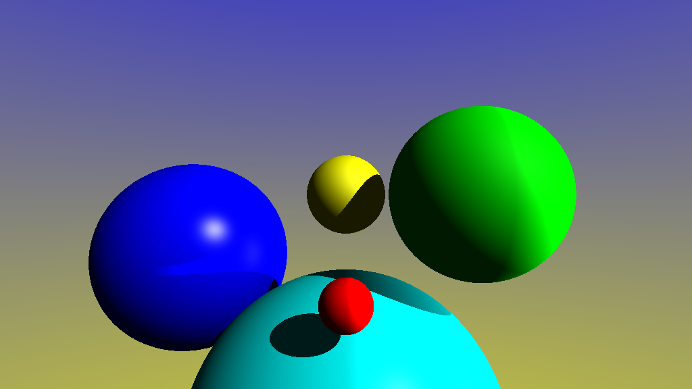

# C++ Raytracer

A real-time 3D raycasting engine built with **C++** and the **openFrameworks** framework. This project implements core computer graphics algorithms, including ray-sphere intersection, Phong 3-point lighting, and shadow mapping.

## 🛠 Technical Implementation

### Core Architecture
* **ofApp**: Manages the main rendering loop, camera viewport settings, and per-pixel color determination through raycasting.
* **Ray Class**: A utility class defining rays with an origin and direction to facilitate world-space intersection calculations.
* **Sphere Logic**: Handles 3D sphere representation and implements a discriminant-based algorithm to detect ray intersections. It utilizes a `HitRecord` to store critical intersection data such as surface normals, collision points, and material properties (albedo, shininess).
* **LightSource**: Defines point lights within the world, supporting the calculation of specular and ambient light components.

### Lighting and Shading
The engine features a robust **Phong lighting model** that calculates the final pixel color by summing the ambient, diffuse, and specular contributions from multiple light sources. To achieve realistic depth, the system performs a **shadow test** for every intersection point by casting secondary rays toward each light source to determine if the path is obstructed by other objects.

## 🚀 Key Features
* **Procedural Geometry**: Dynamic rendering of spheres with customizable positions, radii, and material properties.
* **Multi-Light Support**: Concurrent calculation of lighting effects from multiple point lights with varying strengths.
* **Atmospheric Gradients**: Implements a sky gradient for rays that do not intersect with objects.
* **Shadow Mapping**: Accurate shadow generation based on object-light visibility.
